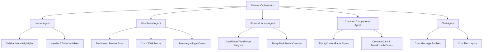

# Shining Sparrow Admin Panel: Full UI/UX Analysis & Redesign Implementation Plan

This document provides a comprehensive audit of the Shining Sparrow Admin Panel, identifying style inconsistencies, visual redundancies, and theme-related defects. It defines a unified design specification using the brand's primary color (Orange) and outlines page-by-page UI/UX improvements. 

Finally, it organizes the implementation into specialized tasks for sub-agents to execute.

---

## 1. Unified Visual System (Google Stitch Design Specification)

To create a combined, single-product experience, all elements must strictly adhere to the following design system token and component rules:

### A. Color Palette
*   **Primary Brand Color**: Orange (`#e86424` / `var(--primary)`).
*   **Secondary/Muted Color**: Warm Taupe/Brown (`#7c6a5e` / `var(--secondary)`).
*   **Border Color**: Warm beige in light mode (`#f0e2d0` / `var(--border)`), charcoal brown in dark mode (`#1c120d` / `var(--border)`).
*   **Theme Backgrounds**:
    *   **Light Mode Background**: `#fdfaf2` (warm cream)
    *   **Dark Mode Background**: `#080504` (very dark charcoal)
*   **Surface Containers (Cards, Sidebar, Header)**:
    *   **Light Mode Surface**: `#ffffff` (pure white)
    *   **Dark Mode Surface**: `#0f0a08` (rich deep dark brown-black)
*   **Surface Muted (Inputs, Hover states)**:
    *   **Light Mode Surface Muted**: `#fbf6eb` (soft warm beige)
    *   **Dark Mode Surface Muted**: `#140d0a` (muted brown-black)

### B. Card Architecture
*   **Radius**: Rounded corners (`border-radius: 12px` / `rounded-xl`).
*   **Borders**: Cards must feature a explicit `1px solid var(--border)` boundary. Avoid raw, solid shadows.
*   **Shadows**: Use soft, diffused, and low-contrast shadows:
    *   `box-shadow: var(--shadow-card)` (`0 1px 3px rgba(0,0,0,0.04)`) for default states.
    *   `box-shadow: var(--shadow-card-hover)` (`0 4px 12px rgba(0,0,0,0.06)`) with a slight hover translation (`-translate-y-0.5`) for interactive cards.
*   **Header Padding**: `16px 20px` with a `1px solid var(--border)` divider separating header from card body.

### C. Input Fields & Form Controls
*   **Height**: Standardized to `42px` for all text fields, select dropdowns, date pickers, and time pickers.
*   **Classes**: Apply `.modern-input` to align padding, borders, focus rings (`var(--primary-ring)`), and placeholder text.
*   **Select Selectors**: Use `.modern-select` to override default browser/Antd select selector styles.

---

## 2. Global Layout & Navigation Audit

### A. Active Menu Highlight Defect
*   **Issue**: In the sidebar, the selected menu item currently highlights in **blue** (`bg-blue-50!`, text `blue-600`, icon `#3b82f6`), contradicting the brand's orange color scheme.
*   **Remedy**: Update `public/assets/css/layout.css` around line 820. Remove hardcoded blue styles and apply:
    *   Background: `bg-primary-soft!` (soft orange)
    *   Text / Icon color: `text-primary!` (brand orange)
    *   Left accent border: `bg-primary!`

### B. Dual Header Text Redundancy
*   **Issue**: Pages show the title twice consecutively (e.g. "Dashboard" breadcrumb and "Dashboard" title block).
*   **Remedy**: Re-align page breadcrumbs and page titles. Remove duplicate `h1`/`h2` elements. Ensure the breadcrumb and primary heading reside in a single breadcrumb banner.

---

## 3. Page-by-Page Audit & UI Enhancements

### 1. Dashboard (`/dashboard`)
*   **Stat Cards**: Replace hardcoded `bg-white` and `border-gray-100` with `bg-surface` and `border-border`. Apply soft opacity backgrounds for stat icons using brand variables (`bg-primary-soft` instead of `bg-blue-50`).
*   **Recent Users / Popular Courses Lists**:
    *   Remove hardcoded hover `bg-gray-50` and border `border-gray-200`; replace with `bg-surface-muted` and `border-border`.
    *   Change Blue "View All" links to brand orange (`text-primary hover:text-primary-dark`).
*   **Completion Rate SVG Chart**:
    *   Replace circle background track `stroke="#e5e7eb"` with `stroke="var(--border)"`.
    *   Update center text colors from `#111827` and `#6b7280` to `fill="var(--foreground)"` and `fill="var(--text-muted)"`.
    *   Align chart color meanings to semantic indicators (Active = Green/Success, Blocked = Red/Danger).

### 2. User Management (`/users` & `/users/:id`)
*   **User Grid/Table**: Convert table header and rows to use `bg-surface` and `var(--border)`. Add smooth transition on row hover to trigger avatar highlight rings.
*   **Advanced Search Drawer**: Style form inputs with the `.modern-input` class. Replace white drawer backgrounds with `var(--surface)`.
*   **User Details Profile Card**: Design a profile card layout with cover image, avatar place, and meta lists. Use `var(--border)` dividers.

### 3. Course & Lesson Editor (`/courses` & `/courses/:id/manage` & `/courses/:id/lesson/:lessonId/edit`)
*   **Course Form / Drawers**: Align labels (`text-text-muted`) and input wrappers. Style currency toggles (`₹` / `%`) with primary orange accents.
*   **Manage Content Syllabus Sections**:
    *   Curriculum cards must utilize `bg-surface` and `border-border`.
    *   Draggable lesson panels must use `bg-surface-muted` and feature hover card transitions.
*   **Tiptap Rich Text Editor**:
    *   Standardize editor box height, padding, and borders to match `.modern-input`.
    *   Ensure the editing canvas background matches `var(--surface)` and text matches `var(--foreground)` to prevent text invisibility in dark mode.

### 4. Workshop Management (`/workshops` & `/workshops/:id/manage`)
*   **Workshop Grid Cards**: Use cover images with fixed aspect ratios (`aspect-video` or `object-cover h-36`).
*   **Workshop Metrics Header Grid**: Apply identical cards for total, active, blocked, and sales metrics using success, danger, and info primary variable alphas (e.g. `bg-success/10 text-success`).
*   **Curriculum Sections**: Make borders consistent with the course syllabus page so the experience feels combined.

### 5. Blog Page (`/blogs`)
*   **Blog Table & Cards**: Style the list view with a consistent card grid. 
*   **Blog Editor Form**: Align Cover Image Upload and Rich Text Editor to the unified width. Make the "Featured" star icon gold (`text-amber-500`) and the tag background soft gold (`bg-amber-500/10`).

### 6. Hero Banner (`/hero-banner`)
*   **Banner Management Cards**: The banner layout cards should show preview slides in `aspect-[21/9]` or `aspect-[16/9]` with a solid `var(--border)` outline and rounded-lg corners.
*   **Upload Area**: Standardize file upload zone boundaries to have a dashed border (`border-dashed border-2 border-border bg-surface-muted`).

### 7. FAQ Page (`/faq`)
*   **FAQ Collapse/Accordion Panel**:
    *   Use Ant Design Collapse with customized tokens: `headerBg: 'transparent'`, `colorBorder: 'var(--border)'`.
    *   Set text colors to `var(--foreground)` and answer text to `var(--text-muted)`.

### 8. About Us & Contact Us (`/about-us` & `/contact`)
*   **Form Wrappers**: Unify page wrapper layouts. Instead of loose forms, wrap inputs in a structured `CommonCard` with sections (`CommonFormSection`) separated by dividers.

### 9. Profile & Settings (`/profile` & `/setting`)
*   **Layout**: Divide the layout into two columns:
    *   **Left Column (1/3)**: Profile Card with avatar upload, name, email, role tag, and status dot.
    *   **Right Column (2/3)**: Update Details Form and Change Password Form under a clean tabbed panel (`antd Tabs` styled with brand orange active lines).

### 10. Coupon Management (`/coupon`)
*   **Coupon Code Tags**: Render coupon codes using a monospace, uppercase font with soft orange background (`bg-primary/10 text-primary border border-primary/20 text-xs font-mono font-bold tracking-wider`).
*   **Validity Dates**: Use soft calendar icons (`CalendarOutlined`) with `text-[11px] text-text-muted` for start/end date details.

### 11. Chat Support (`/chat`)
*   **Flex Sizing**: Set layout height to exactly fill the screen viewport `calc(100vh - 100px)`.
*   **Chat Sidebar**: Background must be `color-mix(in srgb, var(--surface) 96%, var(--foreground) 4%)` with a `1px solid var(--border)` right border.
*   **Message Bubbles**:
    *   **Sent Message**: Brand orange background (`bg-primary text-white`), aligned right.
    *   **Received Message**: Muted surface background (`bg-surface-muted text-foreground`), aligned left.
*   **Input Box**: Standardize input field to use a borderless field nestled inside a clean toolbar card with attachment upload and send button.

---

## 4. Execution Sub-Agent Tasks & Assignments

To implement these changes efficiently, split the execution across specialized sub-agents:

### 👤 Layout Agent
*   **Task**: Standardize the primary sidebar, header, and active menu highlights.
*   **Target Files**:
    *   `src/Layout/Sidebar/index.tsx`
    *   `src/Layout/Header/index.tsx`
    *   `public/assets/css/layout.css` (Menu active items block)

### 👤 Dashboard Agent
*   **Task**: Upgrade dashboard banner, statistics cards, lists, and the completion SVG chart colors.
*   **Target Files**:
    *   `src/Components/Dashboard/DashboardBanner.tsx`
    *   `src/Components/Dashboard/CompletionRateChart.tsx`
    *   `src/Components/Dashboard/PopularCourses.tsx`
    *   `src/Components/Dashboard/RecentUsers.tsx`
    *   `src/Components/Dashboard/CurrentActivity.tsx`
    *   `src/Components/Dashboard/CourseStatusOverview.tsx`
    *   `src/Components/Dashboard/WorkshopSummary.tsx`

### 👤 Forms & Inputs Agent
*   **Task**: Standardize Form input dimensions, Date/Time pickers, and configure Tiptap text editor dark-mode contrast parameters.
*   **Target Files**:
    *   `src/Attribute/FormFields/CommonDatePicker.tsx`
    *   `src/Attribute/FormFields/CommonTimePicker.tsx`
    *   `public/assets/css/update.css` (Inputs & Tiptap editor sections)

### 👤 Common Components Agent
*   **Task**: Standardize breadcrumbs, card visual attributes, modal borders, and empty content layout states.
*   **Target Files**:
    *   `src/Components/Common/CommonCard.tsx`
    *   `src/Components/Common/CommonBreadcrumbs.tsx`
    *   `src/Components/Common/EmptyContentPanel.tsx`

### 👤 Chat Agent
*   **Task**: Set up the chat screen layout heights, scroll areas, and message bubble backgrounds.
*   **Target Files**:
    *   `src/Pages/Chat/index.tsx`
    *   `public/assets/css/chat.css`

---

## 5. Verification Plan

### Stage 1: Static Code Compilation
*   Run `npm run build` in `Shining-Sparrow-Panel` after each sub-agent finishes its scope to verify zero syntax or type-check failures.

### Stage 2: Multimodal Visual Integrity Check
*   Toggle theme between light and dark modes on each page.
*   Validate that:
    1.  The active menu item highlight is brand Orange, not Blue.
    2.  No pages show duplicated headers or breadcrumbs.
    3.  All cards feature identical rounded corners (`12px`) and border structures.
    4.  All text input elements, select boxes, date pickers, and time pickers share the exact same height (`42px`).
    5.  Rich Text Editor panels show clear text in dark mode.
